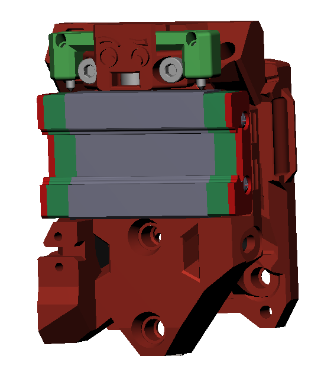
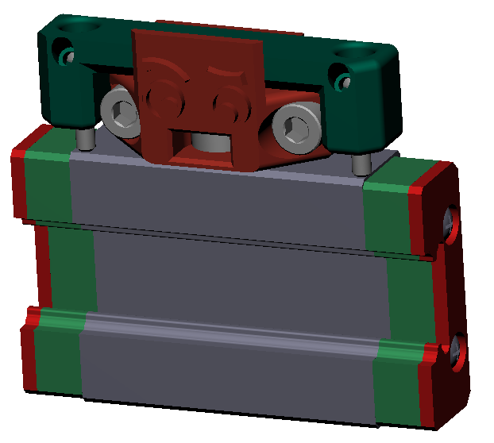

# Unklicky TAP

This is a unklicky sensor for TAP. Thanks to the Voron team for this design and Badnoob for spearheading the effort and lead developer role.

It's almost as precise as the optical sensor, it's main goal is to reduce the initial Voron hug (a lot of people start buying the same obscure part, leaving it out of stock). With that said i can see one using it as a primary sensor as it can achieve a range in probing better than 0.0025 with a standard deviation of 0.001.

**A range of 0.001 is excellent and enough for our 3D printer needs.** don't chase unicorns.

It's pretty easy to install, it does require a somewhat tuned printer.

|  |
| :---------------------------------------------: |

# How does it work?

The principle behind this sensor, is using the MGN12 steel carriage to make contact with two m2x10 self tapping screws, thereby closing the circuit between the mcu GND (or V-) and the probe (should use a endstop) signal pin.

On the image bellow, you can see Unklicky TAP sensor touching the X axis MGN12 carriage.

|  |
| --------------------------------------------------- |

Two 6x3 magnets makes the pin attract the probe body.

More instructions below.

# What do I need?

## Bom
| Name | Pieces |
| ------ | ------ |
| 6x3mm Magnet | 2 |
|M3x8mm screw (not for the slim version)| 2 |
|M2x10 self tapping screw| 2 |
|18 to 22 AWG wire| as required |

# Versions

## Unklicky TAP

|  |
| :----------------------------------------------------------: |

This unklicky TAP is almost a drop in replacement/spare for the optical PCB for TAP, it uses the same footprint, is installed on the same TAP upper part, but only requires 2 cables, a mcu GND (or V-) and the probe (should use a endstop) signal pin, it does not need a 5v connection.

[Check it here](./UnklickyTAP_(requires_umbilical))

## Unklicky TAP slim

|  |
| :----------------------------------------------------------: |

This unklicky TAP slim, is embedded in a new TAP upper part (due to space constrains between TAP and the cable chains), but only requires 2 cables, a mcu GND (or V-) and the probe (should use a endstop) signal pin, it does not need a 5v connection.

[Check it here](./UnklickyTAP_Slim_(used_with_chains))
