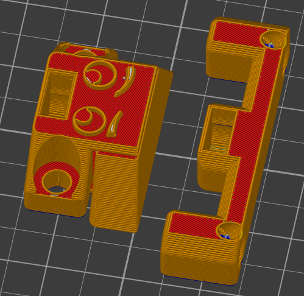
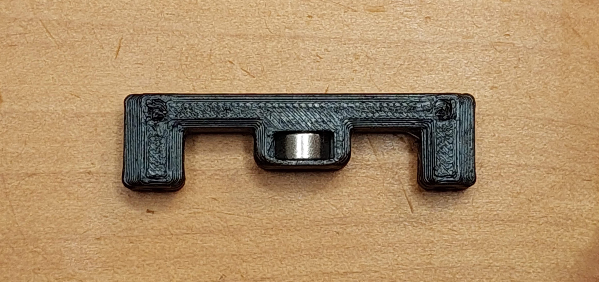
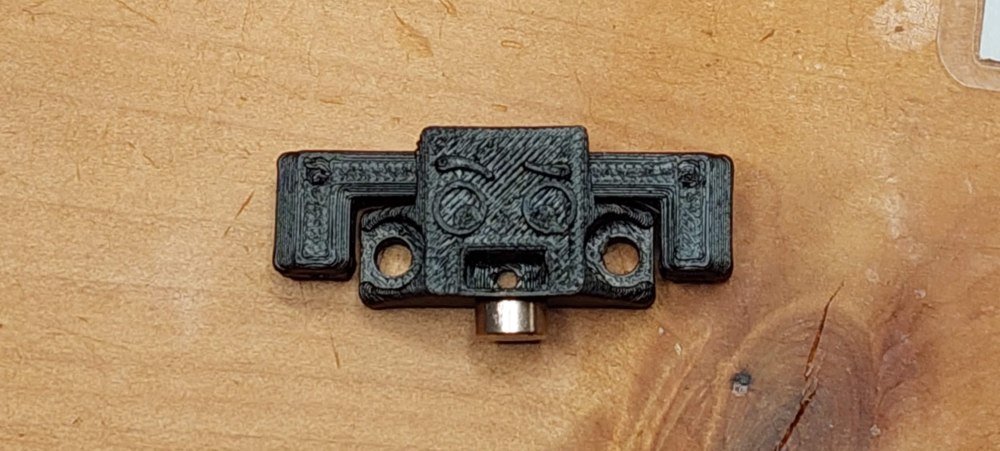
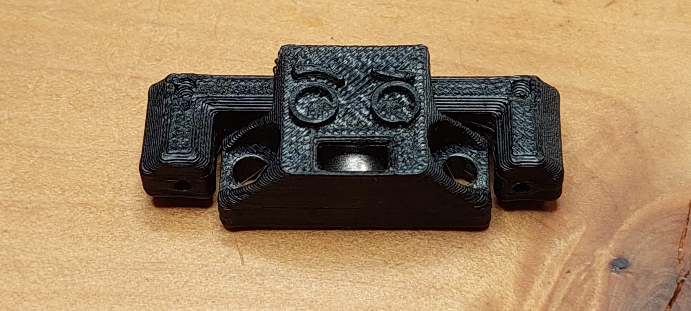
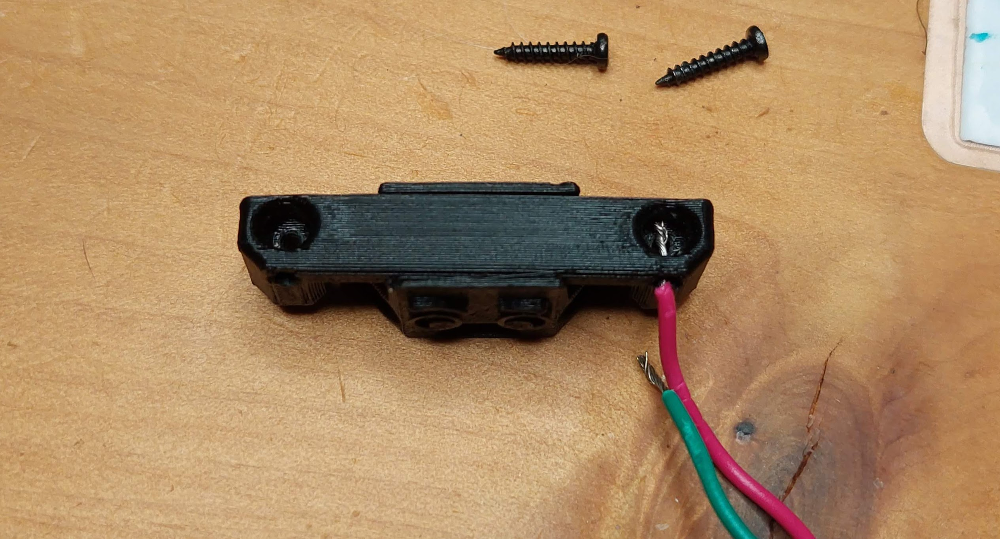
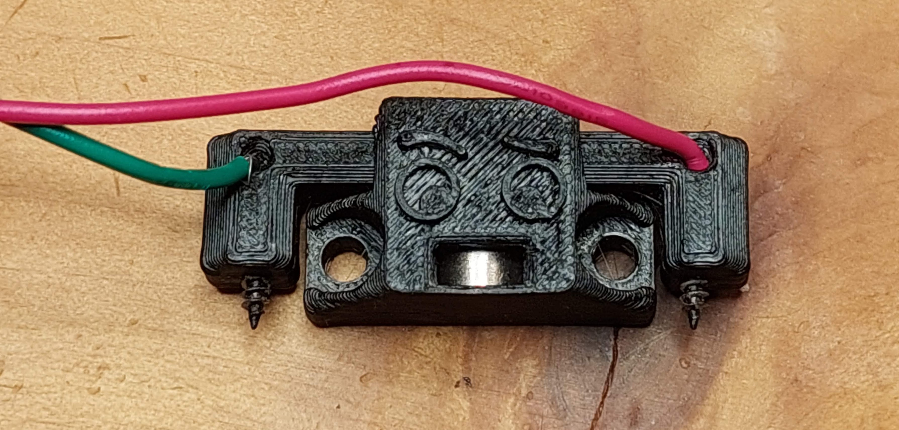

# Unklicky TAP

This is a unklicky sensor for TAP. Thanks to the Voron team for this design and Badnoob for spearheading the effort and lead developer role.

It's almost as precise as the optical sensor, it's main goal is to reduce the initial Voron hug (a lot of people start buying the same obscure part, leaving it out of stock). With that said i can see one using it as a primary sensor as it can achieve a range in probing better than 0.0025 with a standard deviation of 0.001.

**A range of 0.001 is excellent and enough for our 3D printer needs.** don't chase unicorns.

It's pretty easy to install, it does require a somewhat tuned printer.

This version requires a Umbilical, as it's larger than the gap between TAP and the X cable chains, there's [another version](../UnklickyTAP_Slim_(used_with_chains)) that does not have this limitation, but requires change TAP upper part.

This is almost a drop in replacement/spare for the optical PCB for TAP, it uses the same footprint, is installed on the same TAP upper part, but only requires 2 cables, a mcu GND (or V-) and the probe (should use a endstop) signal pin, it does not need a 5v connection.

|  |
| :-------------------------------------------------: |

# How does it work?

The principle behind this sensor, is using the MGN12 steel carriage to make contact with two m2x10 self tapping screws, thereby closing the circuit between the mcu GND (or V-) and the probe (should use a endstop) signal pin.
Two 6x3 magnets makes the pin attract the probe body.

More instructions below.

# What do I need?

## Bom
| Name | Pieces |
| ------ | ------ |
| 6x3mm Magnet | 2 |
|M3x8mm screw| 2 |
|M2x10 self tapping screw| 2 |
|18 to 22 AWG wire| as required |

## Printed parts

| Name | Pieces |
| ------ | ------ |
| Unklicky_TAP_Body.stl | 1|
|Unklicky_TAP_pin_10mm.stl| 1|

The parts should be printed with standard Voron definitions (TBD), they are oriented ready to print.

The TAP Body requires supports, but they are included in the model.

## Build

| Instruction | Image |
| ------ | ------ |
|1. Print the parts as they are oriented and remove the body support.|  |
|2. Insert the pin magnet, it should be insert all the way in|  |
| 3. Place the pin on the sensor body, with the wire holes facing the front. Attach the other magnet to the outside of the body, and make sure that you respect that orientation when it is inserted on the probe boby, both magnets should attract. ||
|4. respecting the polarity, insert the magnet in the sensor body, it should go all the way in, with a bit of force, then stay there. (the groove that holds the magnet was actually designed by Badnoob)||
|5. Slot one of the wires trough the front holes, screw a m2x10 self tapping screw on the hole, making sure it is solidly installed. Repeat this procedure for the other side of the pin.|   |
|6. the sensor is now ready to attach to TAP upper body instead of the Optical PCB sensor.|  |

The rest of the build is exactly the same as a normal [klicky](https://github.com/jlas1/Klicky-Probe "Klicky Probe"), more detailed installation instruction might appear here. 

if you decide to use it, give me feedback, either here, or on Voron discord, my discord user is JosAr#0517, feel free to ping me in this channel  [Help I broke my klicky](https://discord.com/channels/460117602945990666/969563854071799818)

Please feel free to reach out if you have any issues. 
